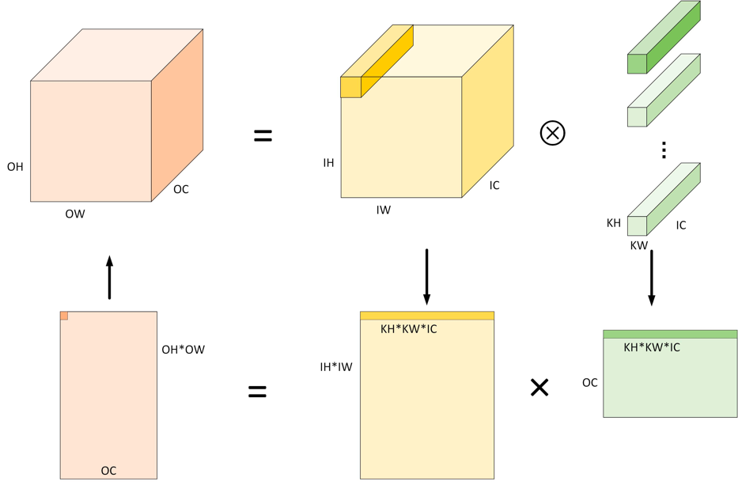

<!--Copyright ©  适用于[License](https://github.com/chenzomi12/AIInfra)版权许可-->

# 核心计算之矩阵乘

AI 模型中往往包含大量的矩阵乘运算，该算子的计算过程表现为较高的内存搬移和计算密度需求，所以矩阵乘的效率是 AI 芯片设计时性能评估的主要参考依据。本节我们一起来看一下矩阵乘运算在 AI 芯片的具体过程，了解它的执行性能是如何被优化实现的。

## 从卷积到矩阵乘

AI 模型中的卷积层的实现定义大家应该都已经比较熟悉了，卷积操作的过程大概可以描述为按照约定的窗口大小和步长，在 Feature Map 上进行不断地滑动取数，窗口内的 Feature Map 和卷积核进行逐元素相乘，再把相乘的结果累加求和得到输出 Feature Map 的每个元素结果。卷积到矩阵乘的的转换关系示意如下图。

其中逐元素相乘，再累加的过程就是上节提到的一个计算单位：MACs，矩阵乘的 MACs 数对最终性能具有重要影响。通过将输入数据（Feature Map）和卷积核数据进行重排，卷积操作本质上可以等效理解为矩阵乘操作。

假设卷积的输入和输出的特征图维度用(IH, IW), (OH, OW)表示，卷积核窗口的数据维度用(KH, KW)表示，输入通道是 IC，输出通道是 OC，输入输出特征图和卷积核数据维度重排的转化对应关系如下公式，对输入数据的重排的过程称为 Im2Col，同理把转换后矩阵乘的数据排布方式再换回卷积输入的过程称为 Col2Im。

$$
\begin{align}
&input:(IC, IH, IW)\rightarrow(OH*OW, KH*KW*IC)\\
&filter: (OC, KH, KW, IC)\rightarrow(OC, KH*KW*IC)\\
&output:(OC,OH, OW)\rightarrow(OC,OH*OW)
\end{align}
$$

更具体的，假设卷积核的维度(2, 2)，输入特征图维度(3, 3)，输入和输出通道都是 1，对一个无 padding，stride=1 的卷积操作，输出特征图是(2, 2)，所以输入卷积核转换为矩阵乘排布后的行数是 $2 * 2 = 4$，列数为 $2 * 2 * 1= 4$。下图是对应的卷积到矩阵乘的转换示意，输入、输出特征图和卷积核都用不同的颜色表示，图中数字表示位置标记。

比如输入特征图的排布转换过程：第 1 个输出对应输入特征图的窗口数据标记为 1, 2, 4, 5；第 2 个输出对应的输入特征图窗口数据标记为 2, 3, 5, 6；第 3 个输出对应的输入特征图窗口数据标记为 4, 5, 7, 8；第 4 个输出对应的输入特征图窗口数据标记为 5, 6, 8, 9。矩阵乘的维度对应关系如下。

$$
\begin{align}
&input: (OH*OW, KH*KW*IC)\rightarrow (4,4)\\
&filter: (OC, KH*KW*IC)\rightarrow(1,4)\\
&output:(OC, OH*OW)\rightarrow(1,4)
\end{align}
$$

## 矩阵乘分块 Tilling

上面介绍了卷积到矩阵乘的转换过程，我们可以发现，转换后的矩阵乘的维度非常大，而芯片里的内存空间往往是有限的（成本高），表现为越靠近计算单元，带宽越快，内存越小。为了平衡计算和内存加载的时间，让算力利用率最大化，AI 芯片往往会进行由远到近，多级内存层级的设计方式，达到数据复用和空间换时间的效果。根据这样的设计，矩阵乘实际的数据加载和计算过程将进行分块 Tiling 处理。

假设用 CHW 表示上面转换公式中的 $KH  * KW * IC$ 的值，M 表示 OC，N 表示 $OH * OW $，矩阵乘的输入特征图维度是 (CHW, N)，矩阵乘的卷积核维度是(M, CHW)，输出矩阵维度是(M, N)，可以同时在 M，N，CHW 三个维度进行 Tiling，每次计算过程分别加载一小块的特征图和卷积核数据计算，比如在 M，N，CHW 三个维度各分了 2 小块，得到完成的输出特征图需要进行 8 次的数据加载和计算。下图中的 Step1, Step2 展示了两次数据加载可以完成一个输出 Tile 块的计算过程。

## 矩阵乘的库

矩阵乘作为 AI 模型中的重要性能算子，CPU 和 GPU 的平台上都有专门对其进行优化实现的库函数。比如 CPU 的 OpenBLAS, Intel MKL 等，GPU 的 cuBLAS, cuDNN 等。实现的方法主要有 Loop 循环优化 (Loop Tiling)和多级缓存 (Memory Hierarchy)。

其两者的实现逻辑大概分为如下 2 步，关于 Kernel 实现优化的技术细节在[推理引擎]章节进一步展开。

1.  Lib 感知相乘矩阵的 Shape
2. 选择最优的 Kernel 实现来执行

下图展示了对矩阵乘进行 Loop 循环优化和多级缓存结合的实现流程。

左边是共 6 级 Loop 循环展开的伪代码，右边是 Loop 对应多级存储的数据 Tilling 和搬移过程，假设矩阵乘 A,B,C 对应维度是(m, k, n)。

- Loop5, Loop4, Loop3 对应把矩阵在 n,  k, m 维度进行 Tilling 的切分，Tilling 后维度大小分别是 nc, kc, mc。
- Loop2, Loop1 分别将 Tilling 后的 nc, mc 维度再一次 Tilling，Tilling 后维度大小分别是 nr, mr。
- Loop0 对 kc 维度进行展开，实现累加求和的过程，得到(mr, nr)大小输出矩阵的部分和。

图中不同的颜色框指代了在不同存储层级上的数据计算，不同颜色块表示该块数据的存储位置。结合不同存储层级的内存空间和数据搬移带宽大小，将不同大小的 A，B 矩阵的 Tilling 块放在不同的存储层级上，可以平衡 AI 芯片执行矩阵乘任务时的时间和空间开销，提升整体算力利用率。比如，对(mr, nr)的计算过程，通过将 B 矩阵的(kc，nr)加载 1 次到 L1 cache 中，每次从 L2 cache 加载 A 矩阵的(mr, kc)大小到计算模块，进行计算，假设 mc 切分了 3 个 mr，则 B 矩阵的(kc, nr)就在 L1 中被重复利用了 3 次。这种用空间换时间或者用时间换空间的策略是进行算子性能优化的主要方向。

## 矩阵乘的优化

矩阵乘作为计算机科学领域的一个重要基础操作，有许多优化算法可以提高其效率。下面我们对常见的矩阵乘法优化算法做一个整体的归类总结。

1. **基本的循环优化**：通过调整循环顺序、内存布局等手段，减少缓存未命中（cache miss）和数据依赖，提高缓存利用率，从而加速矩阵乘法运算。

2. **分块矩阵乘法（Blocked Matrix Multiplication）**：将大矩阵划分成小块，通过对小块矩阵进行乘法运算，降低了算法的时间复杂度，并能够更好地利用缓存。

3. **SIMD 指令优化**：利用单指令多数据（SIMD）指令集，如 SSE（Streaming SIMD Extensions）和 AVX（Advanced Vector Extensions），实现并行计算，同时处理多个数据，提高计算效率。

4. **SIMT 多线程并行化**：利用多线程技术，将矩阵乘法任务分配给多个线程并行执行，充分利用多核处理器的计算能力。

5. **算法改进**：如 Fast Fourier Transform 算法，Strassen 算法、Coppersmith-Winograd 算法等，通过矩阵分解和重新组合，降低了算法的时间复杂度，提高了计算效率。

这些优化算法通常根据硬件平台、数据规模和计算需求选择不同的策略，以提高矩阵乘法运算的效率。在具体的 AI 芯片或其它专用芯片里面，对矩阵乘的优化实现主要就是减少指令开销，可以表现为两个方面：

1. **让每个指令执行更多的 MACs 计算。**比如 CPU 上的 SIMD/Vector 指令，GPU 上的 SIMT/Tensor 指令，NPU 上 SIMD/Tensor,Vector 指令的设计。

2. **在不增加内存带宽的前提下，单时钟周期内执行更多的 MACs。**比如英伟达的 Tensor Core 中支持低比特计算的设计，对每个 cycle 执行 512bit 数据的带宽前提下，可以执行 64 个 8bit 的 MACs，大于执行 16 个 32bit 的 MACs。

## 小结与思考

- AI 模型的矩阵乘运算通过优化内存搬移和计算密度来提升芯片性能，涉及卷积到矩阵乘的转换及分块处理。

- 矩阵乘的优化在软件层面包括减少 MACs、循环优化和内存优化，硬件层面则涉及提高 PE 运算速度、增加并行计算能力和提升 PE 利用率。

- 专用数学库如 OpenBLAS、Intel MKL、cuBLAS 和 cuDNN 通过循环优化和多级缓存管理来提升矩阵乘性能。

- 高效的矩阵乘法优化算法，如 Blocked Matrix Multiplication 和 SIMD/SIMT 技术，以及硬件上的 Tensor Core 设计，共同作用于提升 AI 芯片的计算效率。

## 本节视频

<html>
<iframe src="https://player.bilibili.com/player.html?aid=738378149&bvid=BV1ak4y1h7mp&cid=1053441239&page=1&as_wide=1&high_quality=1&danmaku=0&t=30&autoplay=0" width="100%" height="500" scrolling="no" border="0" frameborder="no" framespacing="0" allowfullscreen="true"> </iframe>
</html>
