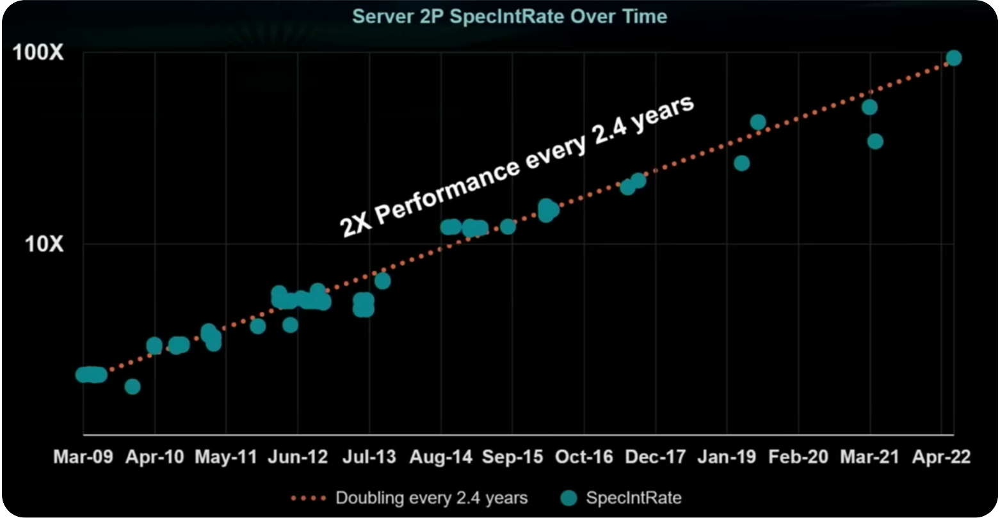

<!--Copyright 适用于[License](https://github.com/chenzomi12/AIInfra)版权许可-->

# CPU 计算本质

本节将深入探讨 CPU 的计算性能，从算力的敏感度和不同技术趋势中分析影响 CPU 性能的关键因素。我们将通过数据和实例，详细解释 CPU 算力的计算方法、算力与数据加载之间的平衡点，以及如何通过算力敏感度分析来识别和优化计算系统中的性能瓶颈。此外，我们还将观察服务器、GPU 和超级计算机等不同计算平台的性能发展趋势，以及它们如何影响着我们对 CPU 性能的理解和期望。

## 从数据看 CPU 计算

平常我们关注 CPU，一般都会更加关注 CPU 的算力 FLOPs，但是当我们更加深入到计算本质的时候，可能会更加关注 CPU 的内核，这个章节我们将会从算力的敏感度，以及服务器和 GPU 等性能趋势，来看一下决定 CPU 性能的效率究竟是什么。

### CPU 算力

算力(Computational Power)，即计算能力，是计算机系统或设备执行数值计算和处理任务的核心能力。提升算力不仅仅可以更快地完成复杂的计算任务，还能够显著的提高计算效率和性能，从而直接影响应用加载速度，游戏流畅度等用户体验。

1. **数据读取与 CPU 计算关系**

对于 CPU 来说，算力并不一定是最重要的。数据的加载和传输同样至关重要。如果内存每秒可以传输 200 GB 的数据（200 GBytes/sec），而计算单元每秒能够执行 2000 亿次双精度浮点运算（2000 GFLOPs），则需要考虑两者之间的平衡。

根据计算强度的公式：

$$
\text{Required Compute Intensity} = \frac{\text{FLOPs}}{\text{Data Rate}} = 80
$$

这意味着，为了使加载数据的成本值得，每加载一次数据，需要执行 80 次计算操作。

2. **操作与数据加载的平衡点**

为了平衡计算和数据加载，每从内存中加载一个数据，需要执行 80 次计算操作。这种平衡点确保了计算单元和内存带宽都能得到充分利用，避免了计算资源的浪费或内存带宽的瓶颈。

因此，虽然提升计算性能（算力）很重要，但如果数据加载和传输无法跟上，即使计算单元的算力再强大，整体效率也无法提升。优化数据传输速率和数据加载策略，与提升计算性能同样重要，以确保系统的整体效率。

3. **CPU 算力计算公式**

CPU 的算力通常用每秒执行的浮点运算次数（FLOPS，Floating Point Operations Per Second）来衡量，这是一个非常重要的指标，尤其是在科学计算、工程模拟和图形处理等需要大量计算的领域。算力的计算可以通过了解 CPU 的核心数、每个核心的时钟频率以及每个时钟周期能够执行的浮点运算次数来进行。

CPU 的算力可以通过以下公式计算：

$$
\text{算力 (FLOPS)} = \text{CPU 核心数} \times \text{每个核心的时钟频率 (Hz)} \times \text{每个时钟周期的浮点运算次数 (FLOP/cycle)}
$$

### 算力计算示例

1. 单核 CPU 算力计算

假设有一个单核 CPU，其时钟频率为 2.5 GHz，每个时钟周期可以执行 4 次浮点运算。

- **核心数**：1
- **时钟频率**：2.5 GHz = 2.5 × 10^9 Hz
- **每个时钟周期的浮点运算次数**：4 FLOP/cycle

算力计算：
 
$$
\text{算力 (FLOPS)} = 1 \times 2.5 \times 10^9 \times 4 = 10 \times 10^9 = 10 \text{ GFLOPS}
$$

2. 多核 CPU 算力计算

假设有一个四核 CPU，每个核心的时钟频率为 3.0 GHz，每个时钟周期可以执行 8 次浮点运算。

- **核心数**：4
- **时钟频率**：3.0 GHz = 3.0 × 10^9 Hz
- **每个时钟周期的浮点运算次数**：8 FLOP/cycle

算力计算：

$$
\text{算力 (FLOPS)} = 4 \times 3.0 \times 10^9 \times 8 = 96 \times 10^9 = 96 \text{ GFLOPS}
$$

3. 超级计算机算力计算

假设有一个超级计算机，有 10000 个 CPU，每个 CPU 有 8 个核心，每个核心的时钟频率为 2.5 GHz，每个时钟周期可以执行 16 次浮点运算。

- **CPU 数量**：10000
- **每个 CPU 的核心数**：8
- **时钟频率**：2.5 GHz = 2.5 × 10^9 Hz
- **每个时钟周期的浮点运算次数**：16 FLOP/cycle

单个 CPU 的算力：

$$
\text{单个 CPU 的算力 (FLOPS)} = 8 \times 2.5 \times 10^9 \times 16 = 320 \times 10^9 = 320 \text{ GFLOPS}
$$

整个超级计算机的算力：

$$
\text{超级计算机的算力 (FLOPS)} = 10,000 \times 320 \times 10^9 = 3.2 \times 10^6 \times 10^9 = 3.2 \text{ PFLOPS}
$$

### 影响 CPU 算力因素

1. 核心数量：核心数量是衡量 CPU 并行处理能力的重要指标之一。每个核心可以独立执行任务，更多的核心意味着 CPU 可以同时处理更多的任务，从而显著提升并行计算的能力。现代 CPU 通常设计为多核心架构，这使得它们在处理复杂的、多线程任务时具有明显的优势。

2. 时钟频率：时钟频率指的是 CPU 每秒钟可以执行的周期数，通常以 GHz（千兆赫兹）为单位。更高的时钟频率意味着 CPU 可以在更短的时间内完成更多的计算任务。

3. 每个时钟周期的浮点运算次数：现代 CPU 架构采用超标量设计和向量化技术来增加每个时钟周期内可以执行的浮点运算次数。浮点运算是处理复杂计算任务的关键，特别是在科学计算和图形处理领域。

4. 缓存和内存带宽：缓存和内存带宽是影响 CPU 数据访问速度的关键因素。高效的缓存系统和足够的内存带宽可以显著减少数据传输的延迟，提高整体计算效率。

5. 指令集架构：指令集架构（ISA）是 CPU 如何执行指令的基础。不同的 ISA（如 x86、ARM、RISC-V）对浮点运算的支持和优化程度有所不同，直接影响 CPU 的算力表现。

## 算力与敏感度

算力敏感度是指计算性能对不同参数变化的敏感程度。在计算系统中，进行算力敏感度分析可以帮助我们了解系统在不同操作条件和数据下的性能表现，并识别出可能存在的性能瓶颈。算力敏感度分析是优化计算系统性能的关键工具。通过理解和分析不同参数对性能的影响，我们能够更好地设计和优化计算系统，从而提升整体性能和效率。

### 算力敏感度关键要素

1. **操作强度（Operational Intensity）**：操作强度常用 ops/byte（操作次数/字节）表示，是指每字节数据进行的操作次数。这一概念在计算机科学中至关重要，尤其在高性能计算领域。操作强度衡量的是计算与内存访问之间的关系。操作强度越高，意味着处理器在处理数据时进行更多计算操作，而不是频繁访问内存。这种情况下，处理器需要的数据带宽相对较低，因为大部分时间花费在计算上，而非在数据传输上。反之，操作强度较低时，处理器的计算操作较少，大部分时间可能花费在内存数据的读取和写入上，这时对数据带宽的需求较高。

2. **处理元素（Processing Elements, PEs）**：处理元素是指计算系统中执行操作的基本单元。它们是计算的核心，负责实际的数据处理任务。在现代计算架构中，处理元素可以是一个独立的 CPU 核心、一个 GPU 流处理器，或是一个专用计算单元。系统中的处理元素数量和性能直接决定了系统的理论峰值性能。处理元素越多，或者它们的计算能力越强，系统能够在单位时间内完成的计算任务就越多，从而提升了系统的整体性能。现代高性能计算系统通常通过增加处理元素的数量或提升单个处理元素的效率来实现性能的提高。此外，处理元素的架构和设计也会影响系统的能源效率和热管理，进而影响到系统的实际应用场景和运行成本。

3. **带宽（Bandwidth）**：带宽是指系统在单位时间内可以处理的数据量，通常以 GB/s（千兆字节每秒）或 TB/s（太字节每秒）为单位来表示。带宽是计算系统中的一个关键指标，直接影响数据传输的效率。带宽限制是影响高操作强度应用性能的主要因素之一。当系统的操作强度较高时，处理器对内存的访问需求降低，此时带宽的瓶颈影响较小。然而，对于那些操作强度较低的应用，处理器频繁访问内存，对带宽的需求极大，如果带宽不足，就会限制系统的整体性能表现。通过优化带宽和存储器架构，可以在一定程度上缓解这些瓶颈问题，从而提升系统的计算效率。
   
4. **理论峰值性能（Theoretical Peak Performance）**：理论峰值性能是指系统在最佳条件下可以达到的最大性能，通常用于评估计算系统的潜在能力。它是通过考虑处理元素的数量、频率及其计算能力来计算的，通常以 FLOPS（每秒浮点运算次数）为单位表示。系统的理论峰值性能是由处理元素的数量、单个处理元素的运算能力，以及操作强度共同决定的。在设计和选择计算系统时，理论峰值性能提供了一个重要的参考指标。然而，实际运行中的性能通常低于理论峰值，因为现实中会遇到各种限制，如带宽瓶颈、内存延迟以及其他系统开销。因此，在实际应用中，优化系统以接近理论峰值性能是高性能计算领域的一个重要目标。通过提高处理元素的效率，优化操作强度，以及改进带宽，可以最大限度地发挥系统的潜在能力。
   
### 算力敏感度重要性

- **识别性能瓶颈**：通过算力敏感度分析，可以识别系统在不同条件下的性能瓶颈，从而优化系统设计。

- **优化资源分配**：了解不同参数对性能的影响，可以更有效地分配计算资源，提高整体系统效率。

- **性能预测**：算力敏感度分析可以帮助预测系统在不同工作负载下的性能表现，指导系统设计和改进。

下图深入解析了计算系统性能与操作强度、处理元素数量以及带宽之间的复杂关系。

当操作强度较低时，系统性能主要受限于带宽，因为处理器需要频繁从内存中读取和写入数据，导致大量时间花费在数据传输上。这一状态下，提升系统带宽可以显著提高性能，减轻传输瓶颈。图的左侧区域明确显示了这一带宽受限的状态。

随着操作强度的增加，处理器可以更多地专注于计算操作而非数据传输，此时系统的性能逐渐转向受限于处理元素的计算能力。也就是说，在高操作强度下，带宽不再是瓶颈，处理元素的数量和性能成为决定系统性能的关键因素。图的右侧区域反映了这种计算受限的状态。

在这两个极端之间，存在一个最佳性能区域。在这个区域内，操作强度与系统的资源利用达到了平衡，使得系统性能接近其理论峰值。这个平衡点是高性能计算中追求的目标，因为它代表了带宽和计算能力的最佳配合，使得系统可以以最优的效率运行。

### 算力发展趋势

1. 逻辑电路技术趋势预测

这张图展示了逻辑电路技术随时间的趋势预测，标题为“逻辑电路技术趋势预测”。纵轴表示性能倍数（如 1.00X 和 10.00X），而横轴表示时间，从 2006 年到 2026 年，展示了 20 年的技术变化。

图中的蓝色圆点代表每次操作的能耗（Energy per operation），而橙色三角形代表密度(Density)。红色虚线表示密度随时间的增长趋势，绿色虚线表示每次操作能耗随时间的变化趋势。体现了逻辑电路技术在过去 20 年间取得了显著进步，随着工艺节点的缩小，每次操作的能耗不断降低，而晶体管的密度不断增加。

2. X86 服务器的性能趋势

这张图展示了服务器性能随时间的变化趋势,纵轴表示性能（Performance），显示了性能倍数（如 10X 和 100X），而横轴表示时间（Time），从 2009 年 3 月到 2022 年 4 月，展示了近 13 年的服务器性能变化。

蓝色圆点代表不同时间点的服务器性能指标（SpecIntRate），我们可以在图中看到这些数据点随着时间推移不断上升。红色虚线表示性能增长的趋势，斜率表明性能的增长速度。图中说明了每 2.4 年服务器的性能就会翻倍，体现了在计算机硬件的领域，尤其在服务器性能的提升趋势。

3. GPU 集群性能趋势

这张图则展示了 GPU 性能随时间的变化趋势，纵轴表示单精度浮点运算性能（GFLOPs），显示性能倍数（如 1,000 GF 和 100,000 GF），而横轴表示时间（Time），从 2005 年到 2025 年，展示了近 20 年来的 GPU 性能的变化。

图中的蓝色圆点代表不同时间点的 GPU 性能指标（单精度浮点运算每秒次数，GFLOPs），可以看到这些数据点随着时间推移不断上升。红色虚线则表示性能增长的趋势，斜率表明性能的增长速度。图中说明了每 2.2 年 GPU 的性能翻倍，也同样体现了 GPU 性能的提升趋势。

4. 超算中心的性能趋势

这张图展示了超算中心性能随时间的变化趋势，纵轴表示浮点运算性能（GFLOPs），显示性能倍数（如 10^3 GF、10^6 GF、10^9 GF 和 10^13 GF），而横轴表示时间（Time），从 1995 年到 2040 年，展示了约 45 年的超算中心性能变化趋势。

5. 训练 AI 大模型的变化趋势

这张图展示了训练 AI 大模型所需时间随模型参数数量的变化趋势，纵轴表示训练时间，单位从“天”（Days）到“周”（Weeks）再到“月”（Months）；横轴表示模型参数的数量，范围从 2 亿到 1008 亿。

图中的折线代表了随着模型参数数量增加，训练时间的变化。可以看到，随着模型参数数量的增加，训练时间呈现出指数增长的趋势。例如，参数数量较少的 Megatron 和 T-NLG 训练时间在数天到数周之间，而参数数量更大的 GPT-3、MT-NLG 和 GLaM 的训练时间则显著增加，达到数月。图表底部的文字描述“Exponentially growing model sizes driving massive growth in compute and memory”进一步强调了模型规模的迅速增长，推动了计算和内存需求的巨大增长。

## 小结与思考

- 算力衡量 CPU 性能：通过核心数量、时钟频率和内存带宽等因素衡量 CPU 算力，算力敏感度分析帮助理解不同参数对性能的影响，优化系统设计。

- CPU 性能和算力发展趋势：随着技术进步，CPU 性能持续提升，算力增长推动了高性能计算、服务器、GPU 集群和超级计算中心的发展，同时 AI 大模型训练时间随模型规模指数增长。

## 本节视频

<html>
<iframe src="https://player.bilibili.com/player.html?aid=354490381&bvid=BV17X4y1k7eF&cid=1078936733&page=1&as_wide=1&high_quality=1&danmaku=0&t=30&autoplay=0" width="100%" height="500" scrolling="no" border="0" frameborder="no" framespacing="0" allowfullscreen="true"> </iframe>
</html>
