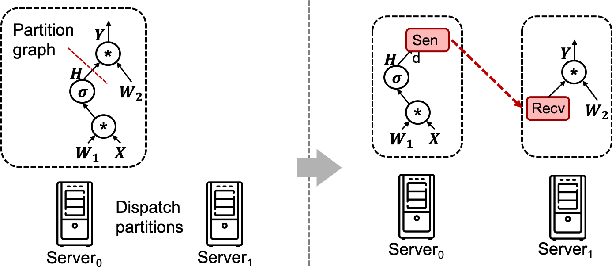
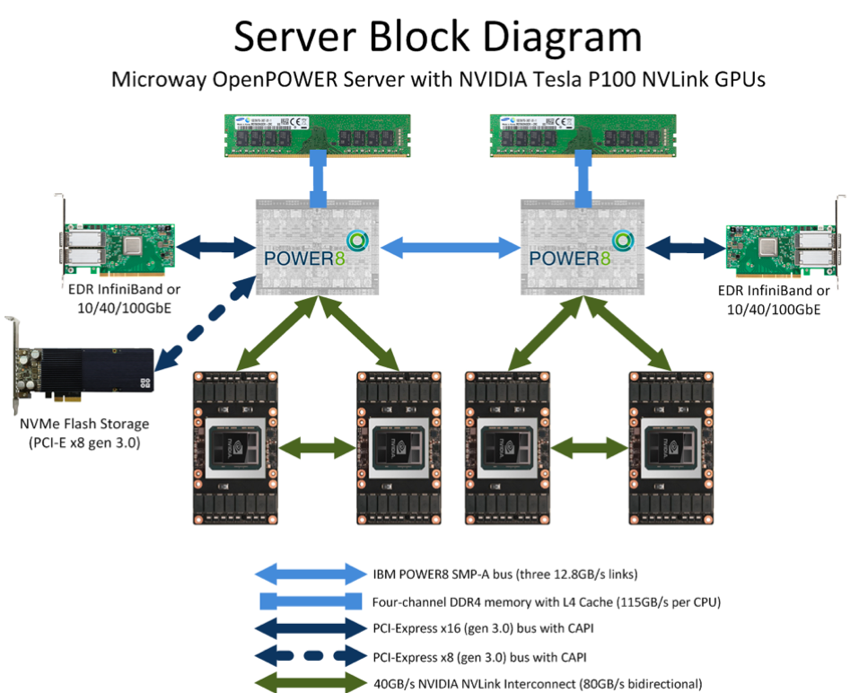
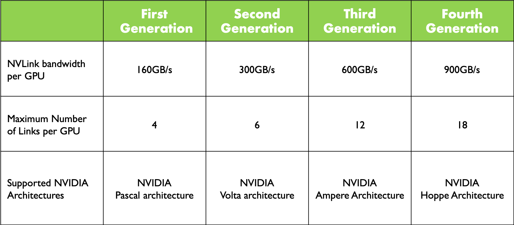

<!--Copyright 适用于[License](https://github.com/chenzomi12/AIFoundation)版权许可-->

# 分布式通信与 NVLink

在进入大模型时代后，大模型的发展已成为人工智能的核心，但训练大模型实际上是一项比较复杂的工作，因为它需要大量的 GPU 资源和较长的训练时间。

此外，由于单个 GPU 工作线程的内存有限，并且许多大模型的大小已经超出了单个 GPU 的范围。所以就需要实现跨多个 GPU 的模型训练，这种训练方式就涉及到了分布式通信和 NVLink。当谈及分布式通信和 NVLink 时，我们进入了一个引人入胜且不断演进的技术领域，本节我们将简单介绍分布式通信的原理和实现高效分布式通信背后的技术 NVLink 的演进。

分布式通信是指将计算机系统中的多个节点连接起来，使它们能够相互通信和协作，以完成共同的任务。而 NVLink 则是一种高速、低延迟的通信技术，通常用于连接 GPU 之间或连接 GPU 与其他设备之间，以实现高性能计算和数据传输。

## 分布式并行

当前深度学习进入了大模型时代，即 Foundation Models。大模型，顾名思义主打的就是“大”，主要包括以下几个方面：

1. **数据规模大**：大模型通常采用自监督学习方法，减少了数据标注，降低训练研发成本，而大量的数据又可以提高模型的泛化能力和性能。

2. **参数规模大**：随着模型参数规模的不断增大，模型可以更好地捕捉数据中的复杂关系和模式，有望进一步突破现有模型结构的精度局限。

3. **算力需求大**：大规模的数据和参数，使得模型无法在单机上运行和计算，这一方面要求计算硬件的不断进步，另一方面也要求 AI 框架具有分布式并行训练的能力。

所以说，为了解决上述问题我们需要引入分布式并行策略。

### 数据并行

数据并行（Data Parallel, DP）是一种常用的深度学习训练策略，它通过在多个 GPU 上分布数据来实现并行处理。在数据并行的框架下，每个 GPU（或称作工作单元）都会存储模型的完整副本，这样每个 GPU 都能独立地对其分配的数据子集进行前向和反向传播计算。

数据并行的工作流程：

1. **参数同步**：在开始训练之前，所有的工作单元同步模型参数，确保每个 GPU 的模型副本是相同的。

2. **分配数据**：训练数据被划分为多个批次，每个批次进一步被分割成多个子集，每个 GPU 负责处理一个数据子集。

3. **独立计算梯度**：每个 GPU 独立地对其数据子集进行前向传播和反向传播，计算出相应的梯度。

4. **梯度聚合**：计算完成后，所有工作单元的梯度需要被聚合起来。这通常通过网络通信来实现，比如使用 All-Reduce 算法，它允许在不同的 GPU 间高效地计算梯度的平均值。

5. **更新参数**：一旦梯度被平均，每个 GPU 使用这个平均梯度来更新其模型副本的参数。

6. **重复过程**：这个过程在每个数据批次上重复进行，直到模型在整个数据集上训练完成。

数据并行的优势和挑战：

数据并行可以允许训练过程水平扩展到更多的 GPU 上，从而加速训练。其优势是实现简单，而且可以灵活的调整工作单元的数量来适应可用的硬件资源，当前多种 AI 框架提供了内置支持。不过数据并行随着并行的 GPU 数量增加，需要存储更多的参数副本，这会导致显著的内存开销。此外，梯度聚合步骤需要在 GPU 之间同步大量数据，这可能成为系统的瓶颈，特别是当工作单元的数量增多时。

为了解决数据并行中的通信瓶颈问题，研究者们提出了各种异步同步方案。在这些方案中，每个 GPU 工作线程可以独立于其他线程处理数据，无需等待其他工作线程完成其梯度计算和同步。这种方法可以显著降低因通信导致的停滞时间，从而提高系统的吞吐量。

实现原理是在梯度计算阶段，每个 GPU 在完成自己的前向和反向传播后，不等待其他 GPU，立即进行梯度更新。其次，每个 GPU 在需要时读取最新可用的全局权重，而不必等待所有 GPU 达到同步点。然而，这种方法也有其缺点。由于不同 GPU 上的模型权重可能不同步，工作线程可能会使用过时的权重进行梯度计算，这可能导致统计效率的降低，即精度上无法严格保证。

### 模型并行

模型并行（Model Parallel, MP）通常是指在多个计算节点上分布式地训练一个大型的神经网络模型，其中每个节点负责模型的一部分。这种方法主要用于解决单个计算节点无法容纳整个模型的情况。模型并行可以进一步细分为几种策略，包括但不限于流水并行（Pipeline Parallel, PP）和张量并行（Tensor Parallel, TP）。

模型并行是一种解决单个计算节点无法容纳模型所有参数的方法。不同于数据并行，其中每个节点处理完整模型的不同数据子集，模型并行将模型的不同部分分布到多个节点上，每个节点只负责模型的一部分参数。这样可以有效降低单个节点的内存需求和计算负载。

在模型并行中，深度神经网络的多个层可以被分割并分配给不同的节点。例如，我们可以将连续的几层分为一组，然后将这组层分配给一个节点。这种分层策略使得每个节点只处理分配给它的一部分模型参数，减少了内存和计算资源的使用。然而，简单的模型并行实现可能会导致显著的等待时间和计算资源的低效利用，因为具有顺序依赖的层需要等待前一层的计算完成。

为了减少这种效率损失，流水并行（Pipeline Parallel, PP）被提出。在流水并行中，一个大的数据批次被分成多个小的微批次（micro-batches），每个微批次的处理速度应该成比例地更快，并且每个 Worker 一旦可用就开始处理下一个微批次，从而加快流水的执行速度。如果有足够的微批次，则可以充分利用 Worker(GPU 卡)，并在步骤开始和结束时将空闲时间“气泡”降至最低。

在流水并行中，每个节点按顺序处理不同的模型层，微批次在节点间流动，就像在流水线上一样。梯度在所有微批次处理完毕后被平均，然后更新模型参数。

流水并行性按层“垂直”分割模型。我们还可以“水平”分割层内的某些操作，这通常称为张量并行训练（Tensor Parallel, TP）来进一步提高效率。

在张量并行中，模型中的大型矩阵乘法操作被分割成更小的部分，这些部分可以在多个计算节点上并行执行。例如，在 Transformer 模型中，矩阵乘法是一个主要的计算瓶颈，通过张量并行，我们可以将权重矩阵分割成更小的块，每个块在不同的节点上并行处理。

在实践中，模型并行可以包括流水并行和张量并行的组合。一个节点可以负责模型的一部分（模型并行），同时处理不同的微批次（流水并行），并且在这个节点内部，大型的矩阵运算可以进一步在多个处理器间分割（张量并行）。这样的组合可以充分利用分布式计算资源，提高大模型训练的效率。

### AI 框架分布式

对于模型训练来说，不管是哪一种并行策略其本质上包括将模型进行“纵向”或“横向”的切分，然后将单独切分出来的放在不同的机器上进行计算，来充分的利用计算资源。

在现在的 AI 框架中，通常都是采取的多种策略的混合并行来加速模型训练的。而要支持这种多种并行策略的训练模型，就需要涉及不同“切分”的模型部分如何通信。

如上图所示，在 AI 计算框架中，我们需要将原来的一个网络模型进行切分，将其分布在不同的机器上进行计算，这里通过在模型中插入 Send 和 Recv 节点来进行通信。

除此以外，在分布式的模型训练中，由于模型的切分我们也需要将模型参数放在不同模型部分所在的机器上，在训练过程中我们会涉及到不同模型节点参数的交互和同步，那也需要跨节点的同步数据和参数，这种就是分布式训练。

以上我们介绍的都是软件层面的分布式策略和算法，接下来我们来看下通信的硬件上是如何实现的。

### 通信硬件

在 AI 训练中，分布式通信是至关重要的，特别是在处理大模型和海量数据时。分布式通信涉及不同设备或节点之间的数据传输和协调，以实现并行计算和模型参数同步，如下图所示。

在机器内通信方面，有几种常见的硬件：

1. **共享内存**：多个处理器或线程可以访问相同的物理内存，这样它们可以通过读写内存中的数据来进行通信。共享内存适用于在同一台机器上进行并行计算的情况。

2. **PCIe（Peripheral Component Interconnect Express）**：PCIe 总线是连接计算设备的一种标准接口，通常用于连接 GPU、加速器卡或其他外部设备。通过 PCIe 总线，数据可以在不同的计算设备之间传输，以实现分布式计算。

3. **NVLink**：NVLink 是一种由英伟达开发的高速互连技术，可实现 GPU 之间的直接通信。NVLink 可以提供比 PCIe 更高的带宽和更低的延迟，适用于要求更高通信性能的任务。

在机器间通信方面，常见的硬件包括：

1. **TCP/IP 网络**：TCP/IP 协议是互联网通信的基础，它允许不同机器之间通过网络进行数据传输。在分布式计算中，可以使用 TCP/IP 网络进行机器间的通信和数据传输。

2. **RDMA（Remote Direct Memory Access）网络**：RDMA 是一种高性能网络通信技术，它允许在不涉及 CPU 的情况下直接从一个内存区域传输数据到另一个内存区域。RDMA 网络通常用于构建高性能计算集群，提供低延迟和高吞吐量的数据传输。

在了解硬件之后，实现通信不可或缺的是提供集合通信功能的库。其中，最常用的集合通信库之一是 MPI（Message Passing Interface），在 CPU 上被广泛应用。而在英伟达 GPU 上，最常用的集合通信库则是 NCCL（NVIDIA Collective Communications Library）。

如上图所示，通过 NCCL 库，我们可以利用 NVLink 或 NVSwitch 将不同的 GPU 相互连接起来。NCCL 在算法层面提供了外部 API，通过这些 API，我们可以方便地进行跨多个 GPU 的集合通信操作。NCCL 的 API 覆盖了常见的集合通信操作，如广播、归约、全局归约、全局同步等，为开发者提供了丰富而高效的并行计算工具。

### 集合通信

集合通信（Collective Communications）是一种涉及进程组中所有进程的全局通信操作。它包括一系列基本操作，如发送（send）、接收（receive）、复制（copy）、组内进程栅栏同步（Barrier），以及节点间进程同步（signal + wait）。这些基本操作经过组合可以构成一组通信模板，也称为通信原语。

例如，一对多的广播（broadcast）、多对一的收集（gather）、多对多的收集（all-gather）、一对多的发散（scatter）、多对一的规约（reduce）、多对多的规约（all-reduce）、组合的规约与发散（reduce-scatter）、多对多的全互连（all-to-all）等。下面我们简单介绍几个。

- **Gather** 操作属于多对一的通信原语，具有多个数据发送者，一个数据接收者，可以在集群内把多个节点的数据收集到一个节点上，他的反向操作对应 Scatter。

- **Broadcast** 属于一对多的通信原语，一个数据发送者，多个数据接收者，可以在集群内把一个节点自身的数据广播到其他节点上。如上图所示，当主节点 0 执行 Broadcast 时，数据即从主节点 0 被广播至其他节点。

- **Scatter** 是数据的一对多的分发，它将一张 GPU 卡上的数据进行分片再分发到其他所有的 GPU 卡上。

- **All-Reduce** 属于多对多的通信原语，具有多个数据发送者，多个数据接收者，其在集群内的所有节点上都执行相同的 Reduce 操作，可以将集群内所有节点的数据规约运算得到的结果发送到所有的节点上。简单来说，AllReduce 是数据的多对多的规约运算，它将所有的 GPU 卡上的数据规约（比如 SUM 求和）到集群内每张 GPU 卡上。

- **All-Gather** 属于多对多的通信原语，具有多个数据发送者，多个数据接收者，可以在集群内把多个节点的数据收集到一个主节点上（Gather），再把这个收集到的数据分发到其他节点上。

- **AllToAll** 操作每一个节点的数据会 Scatter 到集群内所有节点上，同时每一个节点也会 Gather 集群内所有节点的数据。AllToAll 是对 AllGather 的扩展，区别是 AllGather 操作中，不同节点向某一节点收集到的数据是相同的，而在 AllToAll 中，不同的节点向某一节点收集到的数据是不同的。

## NVLlink 与 NVSwitch 发展

NVLink 和 NVSwitch 是英伟达推出的两项革命性技术，它们正在重新定义 CPU 与 GPU 以及 GPU 与 GPU 之间的协同工作和高效通信的方式。

- **NVLink 是一种先进的总线及其通信协议。NVLink 采用点对点结构、串列传输，用于中央处理器（CPU）与图形处理器（GPU）之间的连接，也可用于多个图形处理器（GPU）之间的相互连接。**

- **NVSwitch 是一种高速互连技术，同时作为一块独立的 NVLink 芯片，其提供了高达 18 路 NVLink 的接口，可以在多个 GPU 之间实现高速数据传输。**

这两项技术的引入，为 GPU 集群和深度学习系统等应用场景带来了更高的通信带宽和更低的延迟，从而提升了系统的整体性能和效率。

### NVLink 发展

如上图所示，从 Pascal 架构到 Hoppe 架构，NVLink 已经经过了四代的发展演进。在 2024 年的 GTC 大会上，英伟达发布了 Blackwell 架构，其中 NVLink 再次更新，发布了第五代 NVLink，其中互联带宽达到了 1800GB/s。每一层 NVLink 的更新，其每个 GPU 的互联带宽都是在不断的提升，其中 NVLink 之间能够互联的 GPU 数，也从第一代的 4 路到第四代的 18 路。最新的 Blackwell 架构其最大互联 GPU 数，仍是 18 路并未增加。

从上图可以看出，在 P100 中每一个 NVLink 只有 40GB/s，而从第二代 V100 到 H100 每一个 NVLink 链路都有 50GB/s，通过增加了链路的数量使得整体带宽增加。

### NVSwitch 发展

如上图所示，NVSwitch 技术从 Volta 架构到 Hopper 架构，经历了三代的演进与发展。在每一代中，每个 GPU 互联的芯片模组数量保持不变，都为 8 个，这意味着互联的基本结构保持了稳定性和一致性。随着 NVLink 架构的升级，GPU 到 GPU 之间的带宽却实现了显著的增长，因为 NVSwitch 就是 NVLink 具体承载的芯片模组，从 Volta 架构的 300GB/s 增加到了 Hopper 架构的 900GB/s。

下面我们来看下 NVLink 与 NVSwitch 在服务器中的关系。

如上图所示，在 P100 中只有 NVLink 的，GPU 间通过 CubeMesh 进行互联。在 P100 中，每一个 GPU 有 4 路进行互联，每 4 个组成一个 CubeMesh。

而到了 V100 中，每一个 GPU 可以通过 NVSwitch 和另外一个 GPU 进行互联。到了 A100 中，NVSwitch 再次升级，节省了很多的链路，每一个 GPU 可以通过 NVSwitch 和任何一个 GPU 进行互联。

到了 H100 中，又有了新的技术突破，单机内有 8 块 H100 GPU 卡，任意两个 H100 卡之间都有 900 GB/s 的双向互联带宽。值得注意的是，在 DGX H100 系统里，四个 NVSwitch 留出了 72 个 NVLink4 连接，用于通过 NVLink-Network Switch 连接到其他 DGX H100 系统，从而方便组成 DGX H100 SuperPod 系统。其中，72 个 NVLink4 连接的总双向带宽是～3.6TB/s。

## 小结与思考

- 分布式通信技术的关键作用：在 AI 大模型时代，分布式通信技术如 NVLink 和 NVSwitch 对于实现跨多个 GPU 的高效数据传输和同步至关重要。

- 并行策略的多样化：数据并行和模型并行等分布式并行策略通过在多个计算节点上分布模型或数据，有效提升了大规模 AI 模型训练的效率和资源利用率。

- NVLink 与 NVSwitch 的技术进步：随着 NVLink 和 NVSwitch 技术的不断演进，GPU 间的互联带宽和通信效率显著提升，为神经网络模型训练和大规模并行计算提供了更强大的硬件支持。

## 本节视频

<html>
<iframe src="https://player.bilibili.com/player.html?isOutside=true&aid=868978791&bvid=BV1cV4y1r7Rz&cid=1137554498&p=1&as_wide=1&high_quality=1&danmaku=0&t=30&autoplay=0" width="100%" height="500" scrolling="no" border="0" frameborder="no" framespacing="0" allowfullscreen="true"> </iframe>
</html>
