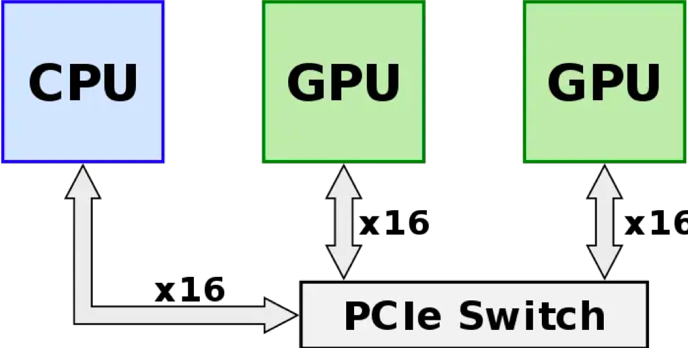
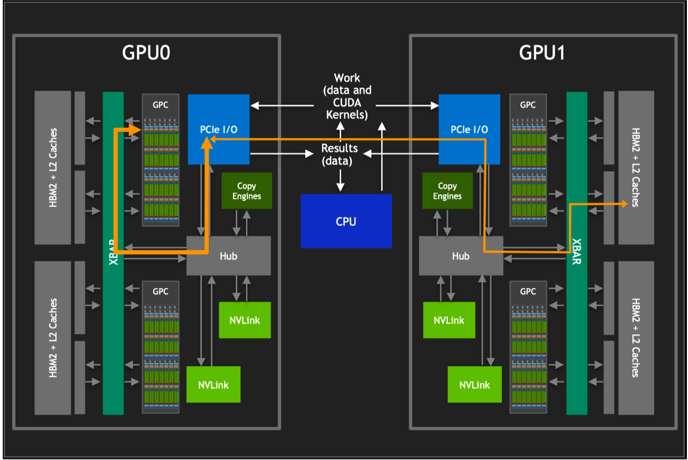
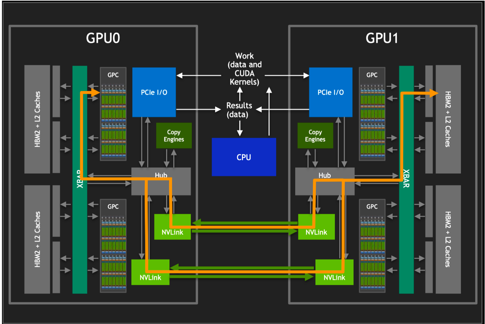
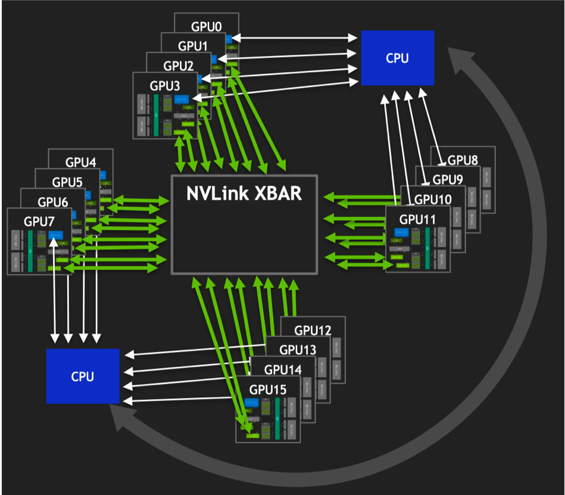
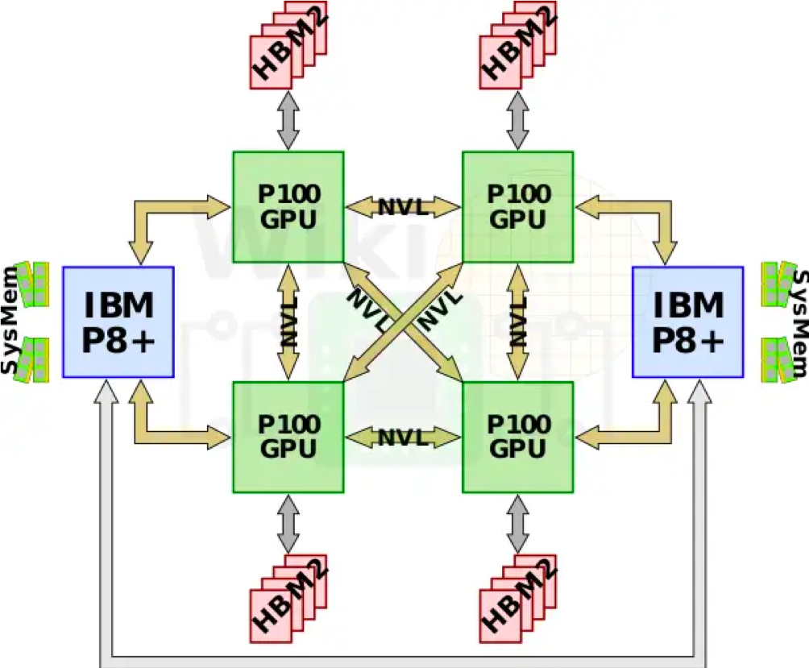
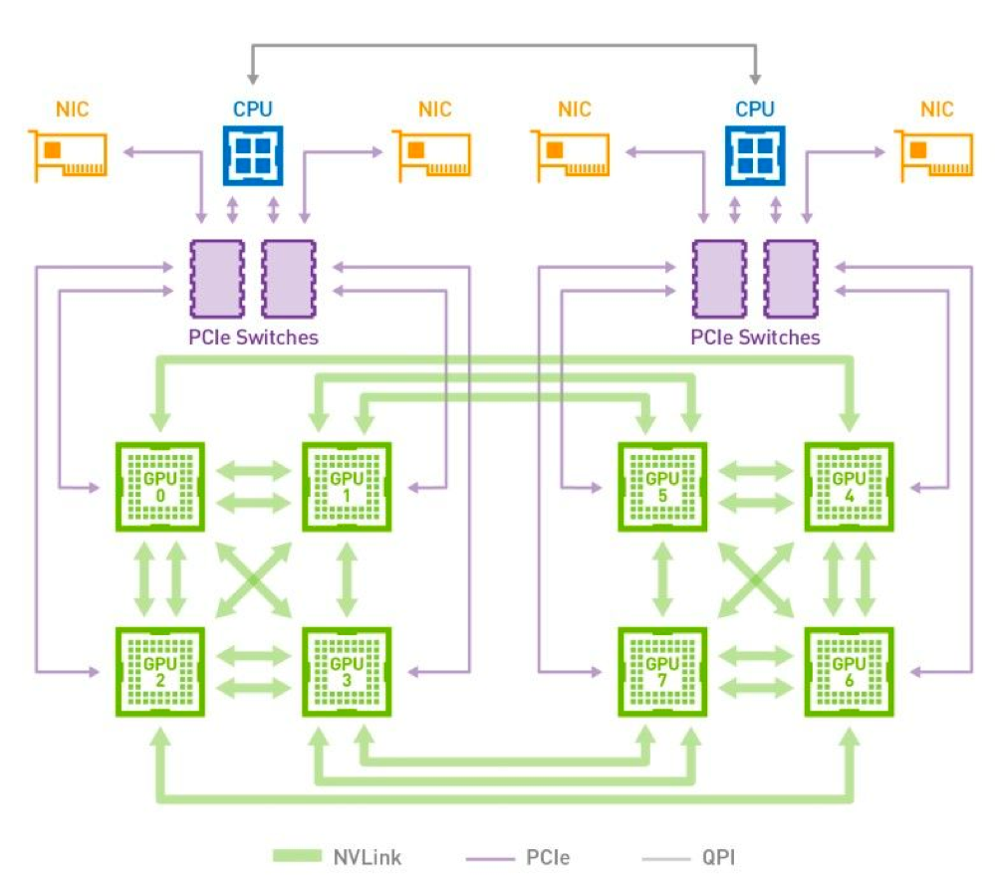

<!--Copyright 适用于[License](https://github.com/chenzomi12/AIFoundation)版权许可-->

# NVLink 原理剖析

随着人工智能技术的飞速发展，大模型的参数量已经从亿级跃升至万亿级，这一变化不仅标志着人工智能的显著提升，也对支持这些庞大模型训练的底层硬件和网络架构提出了前所未有的挑战。为了有效地训练这些复杂的模型，需要依赖于大规模的 GPU 服务器集群，它们通过高速网络相互连接，以便进行快速、高效的数据交换。但是，即便是最先进的 GPU 也可能因为网络瓶颈而无法充分发挥其计算潜力，导致整个算力集群的性能大打折扣。这一现象凸显了在构建大规模 GPU 集群时，仅仅增加 GPU 数量并不能线性增加集群的总体算力。相反，随着集群规模的扩大，网络通信的额外开销也会成倍增加，严重影响计算效率。

在这种背景下，算存互连（即计算与存储之间的连接）和算力互连（即计算单元之间的连接）的重要性变得日益突出。这些互连技术是实现高效大规模并行计算的关键，它们确保数据可以迅速在处理单元和存储设备间传输，最大限度地减少通信延迟，提高整体系统性能。

## PCIe 与 GPU 关系

在解决这一挑战的过程中，PCIe (Peripheral Component Interconnect Express) 和英伟达的 NVLink、NVSwitch 等通信技术扮演了重要角色，本文将深入介绍这几种技术。

### PCIe 互联技术

PCIe 是一种高速串行计算机扩展总线标准，广泛应用于连接服务器中的 GPU、SSD 等设备。它通过提供高带宽和低延迟的数据传输，支持了复杂计算任务的需求。然而，随着计算需求的不断增长，PCIe 的带宽可能成为限制因素。

英伟达的 NVLink 技术则为 GPU 之间提供了更高速度的数据交换能力，其传输速度远超传统的 PCIe 连接，使得数据在 GPU 之间的传输更加高效。此外，NVSwitch 技术进一步扩展了这种能力，允许多达数十个 GPU 之间实现高速、高带宽的直接连接。这种先进的互连技术极大地提高了大规模 GPU 集群处理复杂模型时的数据交换效率，降低了通信延迟，从而使得万亿级别的模型训练成为可能。

在英伟达推出其创新的 NVLink 和 NVSwitch 互联技术之前，构建强大计算节点的常规方法是通过 PCIe 交换机将多个 GPU 直接连接到 CPU，如下图所示。这种配置方式依赖于 PCIe 标准，尤其是 PCIe 3.0 版本，它为每个通道提供了大约 32GB/s 的双向带宽。虽然这在当时被视为高效的数据传输方式，但随着人工智能和机器学习领域的快速发展，数据集和模型的规模呈指数级增长，这种传统的 GPU-CPU 互联方式很快成为了系统性能提升的瓶颈。

随着新一代 GPU 性能的显著提升，它们处理数据的能力大幅增强，但如果互联带宽没有相应的提升，那么这些 GPU 就无法充分发挥其性能潜力。数据传输速度不足意味着 GPU 在处理完当前数据之前，需要等待下一批数据的到来，这导致了计算效率的显著下降。在这种情况下，即使是最先进的 GPU 也无法满足日益增长的计算需求，限制了大规模并行计算系统的整体性能。

正是为了解决这一挑战，英伟达开发了 NVLink 技术，它提供了比 PCIe 3.0 更高的数据传输速率，极大地减少了数据在 GPU 之间传输的时间。NVLink 通过提供更快的数据交换能力，使得多个 GPU 之间可以更高效地共享数据，从而提高了整体的计算性能和效率。

### GPU 互联架构

如图所示，在现代 GPU 架构中，单个 GPU 内部包含了多个流多处理器（SM）核心，这些核心是实现并行计算的基石。通过 CUDA（Compute Unified Device Architecture）技术，开发者能够编写程序来驱动这些硬件单元并行执行复杂的计算任务。CUDA 不仅为程序员提供了一种高效的方式来利用 GPU 的并行处理能力，还极大地简化了并行计算程序的开发过程。

而在 GPU 内部，工作任务被划分并分配给每个图形处理簇（GPC）和流多处理器（SM）核心。这种工作分配机制确保了 GPU 的计算资源得到充分利用，每个核心都在执行计算任务，从而实现了高效的并行处理。为了支持这种高速计算，GPU 通常配备有高带宽内存（HBM），它为 GPC/SM 核心提供了快速访问大量数据的能力，从而保证了数据密集型任务的高效执行。

HBM（High Bandwidth Memory）是一种堆叠式内存技术，它通过宽接口和高传输速率显著提升了内存带宽。这对于处理大规模数据集和复杂计算尤为重要，因为它确保了数据能够迅速地供给到每个 GPC/SM 核心进行处理。此外，GPC/SM 核心之间能够共享 HBM 中的数据，这一特性使得数据交换更为高效，进一步提升了整体的计算性能。

从上面可以看出，在现代 GPU 架构中，主要涉及 GPU 之间的通信和数据交换通常涉及以下几个方面：

1. PCIe 通信：当多个 GPU 在没有专用高速互连技术（如 NVLink）的系统中协同工作时，它们之间的通信通常是通过 PCI Express（PCIe）总线进行的。PCIe 是一种高速串行计算机扩展总线标准，用于连接主板上的硬件设备。但是，由于 PCIe 的带宽有限，它可能成为 GPU 之间高速数据传输的瓶颈。

2. 对 HBM 的访问：如果一个 GPU 需要直接访问另一个 GPU 的 HBM 内存，数据必须通过 PCIe 总线传输，这会受到 PCIe 带宽的限制。这种通信方式比 GPU 内部访问 HBM 的速度慢得多，因为 PCIe 的带宽远低于 HBM 的内存带宽。

3. 通过 CPU 的调度：在没有直接 GPU 对 GPU 通信能力的系统中，CPU 充当数据交换的中介。CPU 负责在多个 GPU 之间分配和调度计算任务，以及管理数据在 GPU 和系统内存之间的传输。

这就使得 PCIe 的带宽限制成为多 GPU 系统中的一个限制因素。特别是当工作负载需要频繁的 GPU 间通信时，在数据传输密集型的应用中，这种限制可能导致性能下降。

NVLink 的出现为 GPU 间的互联提供了一种革命性的方式，使得不同 GPU 之间的通信和数据共享变得更加高效和直接。

通过 NVLink，GPU 的图形处理簇（GPCs）可以直接访问连接在同一系统中其他 GPU 上的高带宽内存（HBM）数据。这种直接的内存访问机制显著降低了数据交换的延迟，并提高了数据处理的速度。同时，NVLink 支持多条链路同时操作，这意味着可以通过多条 NVLink 同时对其他 GPU 内的 HBM 数据进行访问，极大地增加了带宽和通信速度。每条 NVLink 链路都提供了远高于 PCIe 的数据传输速率，多条链路的组合使得整体带宽得到了成倍增加。

此外，NVLink 不仅仅是一种点对点的通信协议，它还可以通过连接到 GPU 内部的交换机（XBARs）来实现更复杂的连接拓扑。这种能力使得多 GPU 系统中的每个 GPU 都能以极高的效率访问其他 GPU 的资源，包括内存和计算单元。而且，NVLink 并不是要取代 PCIe，而是作为一种补充和增强。在某些情况下，系统中可能同时使用 NVLink 和 PCIe，其中 NVLink 用于高速 GPU 间通信，而 PCIe 则用于 GPU 与其他系统组件（如 CPU、存储设备）之间的通信。这种设计允许系统根据不同的通信需求灵活选择最合适的技术，从而最大化整体性能和效率。

如上图所示，NVLink 技术的引入不仅仅是为了加速 GPU 间的通信，它还极大地扩展了多 GPU 系统的潜力。

1. 多 GPU 互联能力的提升：NVLink 极大地提高了多 GPU 之间的互联能力，使得更多的 GPU 可以高效地连接在一起。这种增强的互联能力不仅提升了数据传输的速度和效率，而且还使得构建大规模 GPU 集群成为可能。在深度学习、科学模拟等领域，这意味着可以处理更复杂的问题，实现更高的计算性能。

2. 单一 GPU 驱动进程的全局控制：通过 NVLink，单个 GPU 驱动进程可以控制所有 GPU 的计算任务，实现任务的高效分配和管理。这种集中式控制机制简化了多 GPU 系统的编程和使用，使得开发者能够更容易地利用系统中所有 GPU 的计算能力，从而加速复杂计算任务的处理。

3. 无干扰的 HBM 内存访问：NVLink 还允许 GPU 在不受其他进程干扰的情况下直接访问其他 GPU 的 HBM 内存。通过使用 LD/ST 指令和远程直接内存访问（RDMA）技术，数据可以在 GPU 之间高效地传输，极大地提高了内存访问的速度和效率。这种无干扰的访问机制对于需要大量数据交换的应用至关重要，因为它减少了数据传输的延迟，提高了整体的计算性能。

4. XBAR 的独立演进与带宽提升：GPU 内部的交换机（XBAR）作为桥接器，可以独立于 GPU 核心演进发展，提供更高的带宽和更灵活的连接拓扑。这种设计使得 NVLink 不仅能够支持当前的高性能计算需求，而且还具备了未来进一步扩展和提升性能的潜力。随着 XBAR 技术的发展，我们可以期待 NVLink 将会支持更加复杂和高效的多 GPU 连接方案，进一步推动高性能计算的极限。

## NVLink 技术细节

为了克服传统 PCIe 通信带宽的限制，英伟达开创性地推出了一种名为 NVLink 的高速互连架构。这项技术首次亮相于 P100 GPU 中，标志着高性能计算通信技术的一大飞跃。NVLink 的设计初衷是为了超越传统的 PCIe 通道，实现 GPU 间以及 GPU 与 CPU 之间更高效率、更高带宽的数据传输。

NVLink 的引入不仅仅是技术上的创新，它还代表了英伟达对未来计算架构的深远考量。与 PCIe 相比，NVLink 提供了显著更高的通信带宽和更低的延迟，这对于数据密集型的应用，如深度学习、科学计算和大规模模拟等领域，意味着巨大的性能提升。

值得一提的是，NVLink 的设计也考虑到了 CPU 与 GPU 之间的高带宽通信需求。这一点尤其重要，因为它为异构计算提供了更加紧密和高效的集成方式。虽然基于 x86 架构的 AMD 和 Intel 可能不会直接采用 NVLink，但英伟达与 IBM 的合作展现了 NVLink 技术在非 x86 架构中的巨大潜力。通过在 IBM 的 POWER 微处理器上实现 NVLink，展示了一种全新的、去除 PCIe 瓶颈的通信方式，为高性能计算系统提供了更加高效的数据交换路径。

### 初代 NVLink 结构

第一代 NVLink 技术采用了一种精巧的设计，每条 NVLink 是由一对双工双路信道组成，通过巧妙地将 32 条配线组合起来，形成了 8 对不同的配对。这种独特的结构使得每个方向上能够实现高效的数据传输，具体来说，就是通过 2 位双向传输（2bi）乘以 8 对配对（8pair）再乘以 2 条线（2wire），最终形成了 32 条线（32wire）的配置。

如上图所示，在 P100 GPU 上，英伟达搭载了 4 条这样的 NVLink 通道，每条通道能够提供双向总共 40GB/s 的带宽。这意味着，整个 P100 芯片能够达到惊人的 160GB/s 的总带宽，为数据密集型的应用提供了强大的数据处理能力。

通过这种技术，不仅解决了传统 PCIe 通信带宽瓶颈的问题，而且还为 GPU 之间以及 GPU 与 CPU 之间的通信提供了一条更快、更高效的数据传输路径。为处理更加复杂的计算任务，构建更加强大的计算系统铺平了道路。

### NVLink 实现细节

下面我们来解析下 NVLink 连接的技术细节：

首先，英伟达的 P100 GPU 在其设计中融入了四条 NVLink 通道，这一创新不仅提升了数据传输的速度，还极大地增强了系统的整体性能。P100 通过这些高速通道，实现了高达 94%的带宽效率，这一数字在当时是非常令人印象深刻的，它意味着几乎所有的数据传输都能以极高的效率完成，极大地减少了数据在传输过程中的损耗。

其次，更为重要的是，NVLink 不仅支持 GPU 之间的数据读写操作，还支持原子操作到对等 GPU，这为复杂的计算任务和数据处理提供了更加灵活和强大的支持。此外，P100 还能够通过 NVLink 与支持 NVLink 的 CPU 进行数据读写操作，这一特性极大地提升了 CPU 与 GPU 之间的协同工作效率，为异构计算环境中的数据共享和任务协调提供了更加高效的解决方案。

最后，NVLink 的另一个显著特点是其链接可以被“捆绑”起来以实现更高的带宽。通过将多条 NVLink 通道组合使用，可以进一步提升数据传输速度，满足那些对数据传输速度有极高要求的应用场景。这种灵活的配置方式，使得 P100 能够根据具体的应用需求和工作负载，动态调整数据传输策略，从而优化性能表现。

### NVLink 通信协议

我们再深入 NVLink 协议的细节中进行分析。

在 NVLink 的链接架构中，一个关键的概念是“Brick”，它指的是 NVLink 通道的基本单元。如上图所示，每个 NVLink 是一个双向接口，由 8 个差分对组成，总计 32 条线。这些差分对采用直流耦合（DC coupled）技术，并配置有 85 欧姆的差分终端，以优化信号传输质量。

同时为了进一步提高设计的灵活性和兼容性，NVLink 引入了通道反转（Channel Reversal）和通道极性（Channel Polarity）的概念。这意味着，设备间的物理通道顺序和极性可以根据实际布线和设计需要进行调整，从而简化了物理布局和路由的复杂度。

如上图所示，在数据传输方面，NVLink 采用了基于 flit（flow control digit）的数据包结构。一个单向的 NVLink 数据包可以包含 1 到 18 个 flit，每个 flit 包含 128 位。这种设计允许在单个数据包中传输不同大小的数据，从而提高了传输的灵活性和效率。例如，一个包含 1 个头部 flit（header flit）加上 16 个数据有效载荷 flit（Data payload flit）的数据包可以实现单向 256 字节的传输，达到 94.12%的峰值带宽利用率。而一个包含 1 个头部 flit 加上 4 个数据有效载荷 flit 的数据包，则可以实现单向 64 字节的传输，带宽利用率为 80%。

头部 flit 的结构设计包含了 25 位的循环冗余校验（CRC）、83 位的传输字段（Transaction field）和 20 位的数据链路字段（Data link）。传输字段中包括了请求类型、地址、流量控制位和标记标识符等信息，而数据链路字段则涉及到数据包长度、应用编号标签和确认标识符等内容。地址扩展（Address Extension）机制通过保留静态位，仅传输变化位来进一步优化了数据传输效率。

NVLink 协议通过 25 位 CRC 实现了错误检测，确保了数据传输的可靠性。接收方（Receiver）负责将接收到的数据保存在重播缓冲区（Replay buffer）中，对数据包进行排序，并在确认 CRC 无误后将数据发送回源端。CRC 字段的设计使得最大数据包能够容忍高达 5 个随机位错误，或者在差分对发生突发错误时，支持最多 25 个连续位错误的容错能力。

通过这种精心设计的电气和数据结构，NVLink 不仅提高了数据传输的速度和效率，还确保了在高速传输过程中的稳定性和可靠性，为高性能计算提供了强有力的支持。

### NVLink 互联拓扑

为了实现 GPU 间的高效链接和协作计算，就需要基于 NVLink 系统配置和性能成本要求，来合理的配置 GPU 之间的 NVLink 通道的物理布局和连接方式。

初代 DGX-1 通常采用了一种类似于上图的互联形式。不过，IBM 在基于 Power8+微架构的 Power 处理器上引入了 NVLink 1.0 技术，这使得英伟达的 P100 GPU 可以直接通过 NVLink 与 CPU 相连，而无需经过 PCIe 总线。这一举措实现了 GPU 与 CPU 之间的高速、低延迟的直接通信，为深度学习和高性能计算提供了更强大的性能和效率。

通过与最近的 Power8+ CPU 相连，每个节点的 4 个 GPU 可以配置成一种全连接的 mesh 结构。这种结构使得 GPU 之间可以直接交换数据，并在深度学习和计算密集型任务中实现更高效的数据传输和协作计算。

如上图所示，DGX-1 集成了八块 P100 GPU 和两块志强 E5 2698v4 处理器。然而，由于每块 GPU 只有 4 条 NVLink 通道，因此 GPU 形成了一种混合的 cube-mesh 网络拓扑结构。在这种结构中，GPU 被分成两组，每组四块 GPU，并且在组内形成了一个 mesh 结构，在组间形成了一个 cube 结构。

此外，由于 GPU 所需的 PCIe 通道数量超过了芯片组所能提供的数量，因此每一对 GPU 将连接到一组 PCIe 交换机上，然后再与志强处理器相连，如上图所示。随后，两块 Intel 处理器通过 QPI 总线相连。

这种配置确保了每个 GPU 都能获得足够的 PCIe 带宽，以便在深度学习和高性能计算任务中能够高效地进行数据传输和处理。同时，通过 QPI 总线连接的两块 Intel 处理器也为系统提供了高速的 CPU 之间通信通道，进一步提升了整个系统的性能和效率。

### 第五代 NVLink

在 2024 年的 Blackwell 架构中英伟达继续对其服务器带宽和可扩展性方面进行迭代。

总体上看，英伟达将 NVLink 的带宽从每 GPU 900GB/s 增加了一倍，达到每 GPU 1800GB/s。与上一代产品相比，这是过去几年来 NVLink 带宽的最大跃升，因为 2022 Hopper 架构的 NVLink 带宽仅比上代提高了 50%。

值得注意的是，尽管英伟达将 GPU 芯片数量翻倍，互连带宽也翻了一倍，因此每个芯片接收的数据量并没有改变。然而，由于两个芯片需要作为单个处理器一起工作，因此需要传输和重新排列的数据总量显着增加。

另一个有趣的方面是，每个 GPU 的 NVLink 数量没有改变，GH100 Hopper 的 NVLink 容量为 18 个链接，Blackwell GPU 的 NVLink 容量也是 18 个链接。因此，NVLink 5 带来的所有带宽增益都来自于链路内每个高速对的 200Gbps 更高信号传输速率。这与前几代 NVLink 的模式是一致的，每次迭代都会使信号传输速率翻倍。

除此之外，由于 NVLink 4 的链路数量保持不变，本地芯片拓扑选项基本上也保持不变。英伟达的 HGX H100 设计结合了 4 路和 8 路设置，HGX B200/B100 设置也将相同。这并不意味着英伟达没有增加 NVLink 域中 GPU 数量的雄心，但这将在机架级别而不是节点级别实现。

## 小结与思考

- NVLink 技术的重要性：随着人工智能模型参数量的激增，传统的 PCIe 总线已无法满足 GPU 间及 GPU 与 CPU 间的高速数据传输需求，NVLink 技术通过提供远超 PCIe 的传输速度和低延迟，有效解决了这一瓶颈问题。

- NVLink 的技术细节：NVLink 通过创新的通道设计和高效的数据包结构，实现了高带宽利用率和错误检测能力，其灵活的拓扑结构和对等通信支持，为大规模 GPU 集群的高效协作计算提供了可能。

- NVLink 的发展与演进：自 P100 GPU 首次引入 NVLink 以来，该技术已经历了多代发展，最新一代的 NVLink 在 Blackwell 架构中实现了每 GPU 1800GB/s 的惊人带宽，进一步推动了高性能计算和神经网络模型训练的能力。

## 本节视频

<html>
<iframe src="https://player.bilibili.com/player.html?isOutside=true&aid=314206309&bvid=BV1uP411X7Dr&cid=1144686167&p=1&as_wide=1&high_quality=1&danmaku=0&t=30&autoplay=0" width="100%" height="500" scrolling="no" border="0" frameborder="no" framespacing="0" allowfullscreen="true"> </iframe>
</html>
